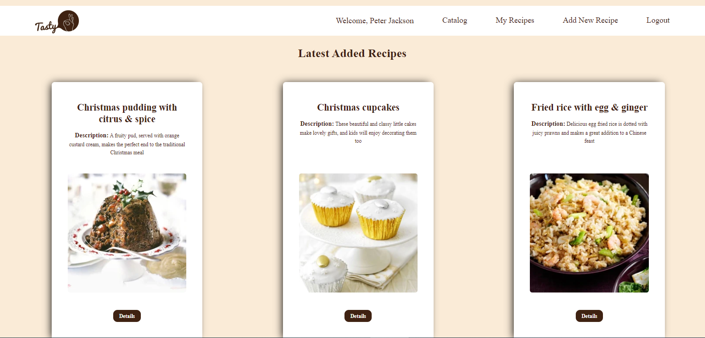

# Getting Started with CookBook - React App
---
---


---
---

The CookBook is an app where every user can create his own profile and can create, edit and delete his own recipes, view recipes created by other users and can like their recipes.


## Install app

/Execute from project root directory/

Install project dependencies:
```
npm install
```
Start the app:
```
npm start
```

Open in browser:
```
http://localhost:3000/
```
## Install SoftUni Practise Server

;
```
npm install
```

Start server: 
```
node server.js
```
## Basic dependencies
* Use SoftUni practice server
* Use React JS for front-end


